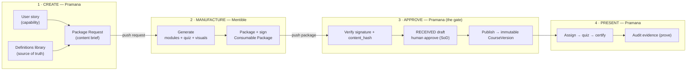
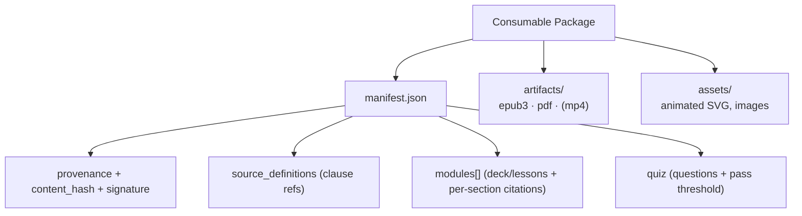
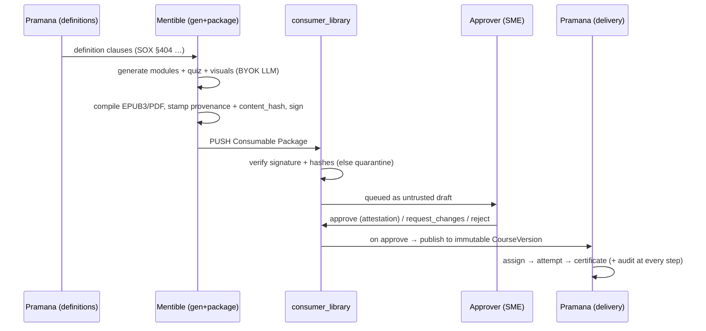
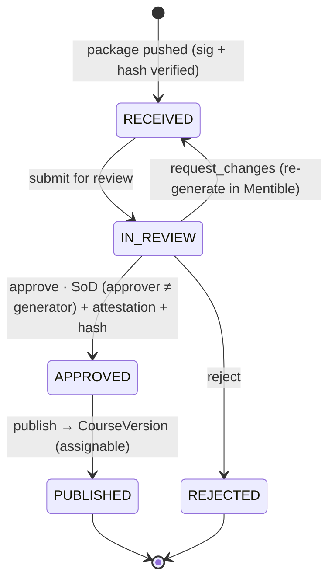

# ADR-011 — Mentible ⇄ Pramana compliance integration (the consumable handoff)

**Status:** Proposed — 2026-06-05 (awaiting decision)
**Decision-maker:** Sivakumar Mambakkam / WeGoFwd
**Relates to:** ADR-004 (two-product split + artifact delivery), ADR-003
(book authoring), the animated-visuals path (`docs/animated-visuals-prototype.md`),
and Pramana's `docs/03_ai_drafted_human_approved_content.md`.
**Authoritative for:** the Mentible→Pramana **handoff contract**. Pramana consumes
this definition (it is the source of truth for the package format + flow).
**Amended by:** **ADR-013** — §3.1/§8's *"Pramana never generates content"* is
**narrowed**: Pramana may generate a defined class of **text-first compliance
artifacts in-process** (clause summaries, quiz items, control/attestation text)
via the shared `wegofwd-llm` seam, behind the **same** approval gate. Mentible
remains the sole producer of the **packaged learner consumable** (§4). Read ADR-013
alongside §3 and §8.

---

## 1. Context (North Star)

Two products, one pipeline:

- **Pramana** owns the **source of truth** — a **library of definitions** of
  compliance rules / regulations / standards (today: `pramana/docs/frameworks/*`
  — SOX, HIPAA, GDPR, ISO-27001, PCI). It also **delivers + tracks** training
  (assignments, attempts, quizzes, SOX audit trail, certificates).
- **Mentible** is the **generation + packaging engine** — it consumes Pramana's
  definitions and produces a **client-consumable package** (deck/lessons + quiz +
  animated visuals + compiled EPUB3/PDF artifact).
- The package is **delivered into Pramana's `consumer_library`**, from which
  Pramana ingests → human-approves → publishes → assigns.

The integration boundary is an **artifact handoff**, not a service call: Mentible
*ships a consumable*; Pramana does not call a "generation service." This ADR
defines that handoff so Pramana can build against it.

### Mental model — Create → Manufacture → Approve → Present

Four phases; the two boundaries are artifact handoffs (a **Package Request** out — §4
"The Package Request" — and a **Consumable Package** back). **Pramana says *what*,
Mentible makes the *thing*, Pramana approves it and presents it.** The **approve**
step is the compliance-critical gate: manufactured content never reaches a learner
un-approved.



## 2. System context

```mermaid
flowchart LR
  subgraph SRC["PRAMANA · source of truth"]
    DEF["Definitions Library<br/>SOX · HIPAA · GDPR · ISO · PCI"]
  end
  subgraph MEN["MENTIBLE · generation + packaging engine"]
    GEN["Scoped LLM generation<br/>lessons + quiz"]
    VIS["Visuals<br/>animated SVG · KaTeX · Mermaid"]
    PKG["Package compiler<br/>build + sign Consumable"]
  end
  subgraph DEL["PRAMANA · delivery + tracking"]
    CL["consumer_library<br/>received consumables"]
    APR["Ingestion review<br/>+ approval · SoD"]
    CV["CourseVersion<br/>immutable · hashed"]
    ASN["Assign → Attempt →<br/>Certificate + Audit"]
  end
  DEF -->|definitions| GEN
  GEN --> VIS --> PKG
  PKG -->|consumable package<br/>artifact handoff| CL
  CL --> APR -->|publish| CV --> ASN
```



## 3. Decision

1. **Mentible generates + packages; Pramana defines + delivers.** Mentible never
   assigns or tracks; Pramana never generates content.
2. **The unit of exchange is a versioned, signed `Consumable Package`** (§4) —
   self-describing, provenance-stamped, and traceable back to the definition
   clauses it covers.
3. **Delivery is a one-way push** into `consumer_library` (§6). Pramana treats an
   arrival as *untrusted draft* until a human approves it.
4. **The human-approval gate lives at Pramana's ingestion** (§7), reusing the
   content-approval state machine already built (pramana PR #1). Generation in
   Mentible does **not** bypass it.
5. **This document is the contract.** Either side may evolve, but the package
   schema + flow change only by amending this ADR.

## 4. The Consumable Package (the handoff contract)

A package is a signed bundle: a JSON **manifest** + referenced **artifacts**.

```jsonc
{
  "package_id": "uuid",                     // stable id for this consumable
  "package_version": 1,                     // bumped on re-generation
  "title": "SOX §404 Controls for Managers",
  "frameworks": ["sox"],                    // which standards this covers
  "source_definitions": [                   // traceability to Pramana's library
    { "framework": "sox", "clause": "404",
      "ref": "pramana/docs/frameworks/framework_sox.md#404" }
  ],
  "provenance": {                           // how it was produced (audit + drift)
    "engine": "mentible",
    "model": "claude-sonnet-4-6",
    "provider": "anthropic",
    "prompt_version": "psai-2026-06",
    "generated_at": "2026-06-05T12:00:00Z"
  },
  "content_hash": "sha256:…",               // hash of the canonical content body
  "modules": [                              // the training content (deck/lessons)
    { "order": 0, "heading": "…", "body_markdown": "…",
      "citations": [{ "framework": "sox", "clause": "404" }] }
  ],
  "quiz": { "pass_threshold_pct": 80, "questions": [ /* … */ ] },
  "assets": [ { "id": "fig-1", "type": "animated_svg", "uri": "assets/fig-1.svg" } ],
  "artifacts": [                            // compiled deliverables
    { "format": "epub3", "uri": "artifact.epub" },
    { "format": "pdf",   "uri": "artifact.pdf" }
  ],
  "signature": "…"                          // integrity of the manifest + hashes
}
```

| Field group | Purpose | Maps to (Pramana) |
|---|---|---|
| `source_definitions` / `modules[].citations` | **Traceability** — a reviewer verifies content against the regulation, not vibes | the definitions library; `ContentDraft.source_citations` |
| `provenance` + `content_hash` | **Audit + drift** — who/what produced it; detect outdated model/prompt | `ContentDraft` provenance + `content_hash` |
| `modules` + `quiz` | The training content + assessment | `CourseVersion` + `Question`/`AnswerOption` |
| `assets` (animated SVG) | Free animated visuals | rendered in the consumable; still-frame in static artifact |
| `artifacts` (epub3/pdf) | The packaged deliverable | stored object refs |
| `signature` | Tamper-evidence at the boundary | verified on ingest, recorded in audit |

**Note — video:** "video" is the *narrated deck* composition (slides + animated
SVG + TTS → MP4), not AI-generated video; if present it is just another entry in
`artifacts` (`{"format":"mp4", …}`). No paid video model.

### Package structure


### The Package Request (Pramana → Mentible) — the reverse direction

The package above is Mentible's **output**. The **input** that commissions it is a
**Package Request**: the *spec side* of the manifest, authored on the Pramana side
(by a compliance SME / content author, typically distilled from a product user
story). This resolves the §10 "definitions feed" question — Mentible does **not**
free-read Pramana's docs; it is handed an explicit, auditable request that
**references** clause anchors in Pramana's definitions library.

```jsonc
{
  "request_id": "uuid",
  "requested_by": "sme@customer",        // audit: who authorized generation
  "framework": "fcpa",
  "title": "FCPA Anti-Bribery for At-Risk Roles",
  "scope": { "personas": ["employee"], "risk_tier": "high" },
  "source_definitions": [                // refs into Pramana's definitions library
    { "framework": "fcpa", "clause": "anti-bribery",
      "ref": "pramana/docs/frameworks/framework_fcpa.md#anti-bribery" }
  ],
  "learning_objectives": [ "…" ],        // → modules[]
  "assessment": { "required": true, "pass_threshold_pct": 80,
                  "min_questions": 8, "style": "scenario-based" },  // → quiz
  "constraints": { "every_claim_cited": true, "length_minutes": 20 },
  "deliverables": ["epub3", "pdf"],      // → artifacts[]
  "visuals": ["animated_svg"],           // → assets[]
  "satisfies_stories": ["US-FCPA-0001"]  // traceability into Pramana's backlog
}
```

| Package Request (input) | → Manifest (Mentible output, §4) |
|---|---|
| `framework`, `title` | `frameworks`, `title` |
| `source_definitions` | `source_definitions` + per-`module.citations` |
| `learning_objectives` + `constraints` | `modules[]` |
| `assessment` | `quiz { pass_threshold_pct, questions }` |
| `deliverables` / `visuals` | `artifacts[]` / `assets[]` |
| — (Mentible decides) | `provenance`, `content_hash`, `signature`, `package_id`/`version` |

**Precondition:** every `source_definitions[].ref` must resolve to a real clause
anchor in `pramana/docs/frameworks/*` (Pramana owns the definitions — §1). No
definition, no request. The authoring guide + worked examples live on the Pramana
side at `pramana/docs/user-stories/_templates/package-request.md` and
`…/<framework>/briefs/`.

## 5. End-to-end flow



## 6. Delivery mechanism (the boundary)

- **Transport:** Mentible PUSHes the package to a Pramana **ingestion endpoint**
  (or an object-storage drop + manifest notification). One-way; idempotent on
  `(package_id, package_version)`.
- **Trust:** Pramana **verifies the signature + `content_hash`** on arrival; a
  failure quarantines the package (never silently published).
- **No live coupling:** Mentible does not read Pramana's DB and Pramana does not
  call Mentible's generator — consistent with ADR-002 (no cross-product imports).
  The contract is the package, nothing else.

## 7. Ingestion → approval → publish (Pramana side)

Reuses the content-approval state machine already built (pramana PR #1): an
arrival is a `RECEIVED` draft; nothing is assignable until a human (≠ the
generator) approves it and it is published into an immutable `CourseVersion`.



## 8. Responsibility split

| Concern | Mentible | Pramana |
|---|---|---|
| Definitions library (source of truth) | — | ✅ owns |
| Content generation (lessons/quiz/visuals) | ✅ owns | — |
| Artifact packaging (EPUB3/PDF, signing) | ✅ owns | — |
| Provenance + content hash | ✅ stamps | ✅ stores + audits |
| Delivery into `consumer_library` | ✅ pushes | ✅ ingests + verifies |
| Human approval (SoD) + publish | — | ✅ owns |
| Assign / track / certify / audit | — | ✅ owns |

## 9. What Pramana must build to consume this (hand-off checklist)

1. **`consumer_library`** ingestion: an endpoint/drop that accepts a Consumable
   Package, verifies signature + `content_hash`, and creates a `RECEIVED` draft.
2. **Manifest → domain mapping:** package `modules`/`quiz` → `CourseVersion` +
   `Question`/`AnswerOption`; `source_definitions`/`citations` → traceability;
   `provenance` → the draft's provenance fields.
3. **Approval at ingestion** (already specced/started — pramana ADR-03 + PR #1).
4. **Artifact storage** (S3 Object-Lock) for the epub3/pdf/(mp4) + the signed
   manifest, as audit evidence.

## 10. Open questions

- **Push vs pull** at delivery (Mentible POSTs vs Pramana polls a drop)?
- **Signing scheme** (key custody for the package signature)?
- **Re-generation versioning** — a new `package_version` supersedes; how does
  Pramana relate it to an existing `CourseVersion` lineage + in-flight assignments?
- ~~**Definitions feed** — does Mentible read the framework docs directly, or does
  Pramana export a machine-readable definitions feed for generation?~~
  **Resolved (§4 "The Package Request"):** neither — Pramana issues an explicit,
  auditable **Package Request** that *references* clause anchors in its definitions
  library; Mentible generates against that request, not by free-reading the docs.
- **Animated SVG / video in the static artifact** — still-frame + caption fallback
  (per the artifact interactive-vs-static matrix).

## 11. Recommendation

Adopt the **Consumable Package** as the single integration unit and the
**push-to-`consumer_library` + approve-at-ingestion** flow. Build the Pramana
side against §4 + §7; keep Mentible's generator unchanged except for the
**packager** that emits §4. Start with a thin slice: one framework (SOX §404),
one package, the full receive→approve→publish→assign path.
